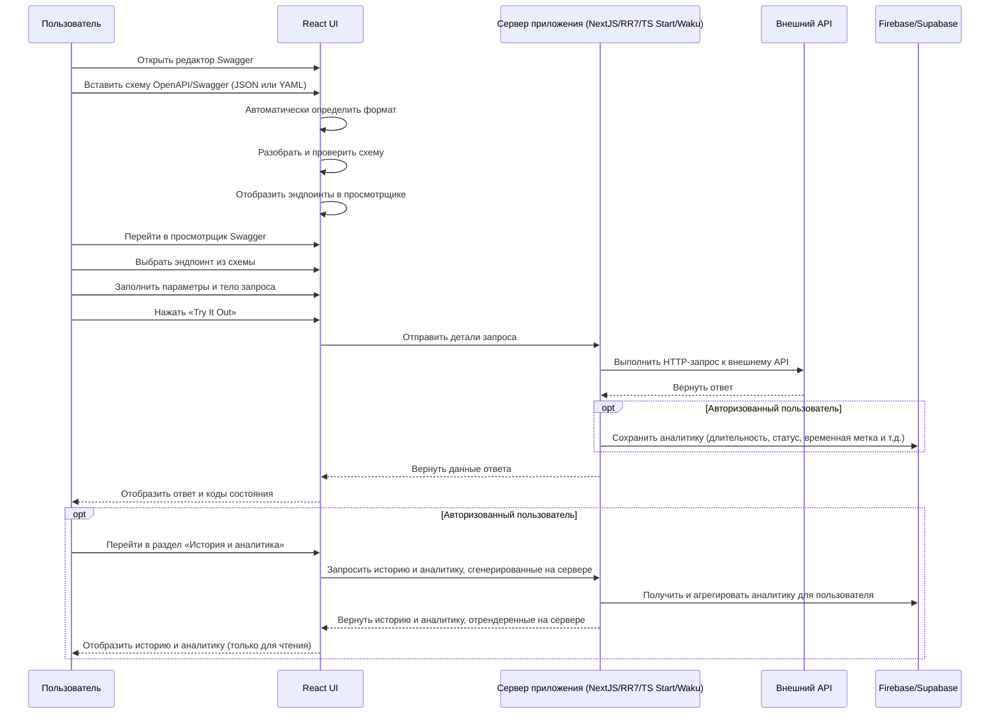

# Интерфейс Swagger/OpenAPI UI

## Варианты фреймворков

Вы можете выбрать один из нескольких современных React-фреймворков для вашего проекта. Все они поддерживают серверную логику, маршрутизацию и подходят для создания полноценных React-приложений:

- **React Router 7 (Framework mode)**: Последняя версия React Router, теперь с функциями, объединёнными из Remix. [Документация](https://reactrouter.com/start/modes#framework)
- **Next.js (App Router)**: Рекомендуемый способ использования Next.js для полнофункциональных React-приложений. [Документация](https://nextjs.org/docs/app)
- **Vinext**: API-поверхность Next.js, перереализованная на Vite. [Документация/Код](https://github.com/cloudflare/vinext)
- **Tanstack Start**: Современный полнофункциональный React-фреймворк от создателей TanStack Query. [Документация](https://tanstack.com/start/latest)
- **Waku**: Минималистичный React-фреймворк для создания полноценных приложений. [Документация](https://waku.gg/)

Вы можете выбрать любой из этих вариантов, исходя из предпочтений команды и требований проекта.

Вам предстоит создать приложение **Swagger/OpenAPI UI** с возможностью работы с REST-клиентом в рамках одного приложения. Это позволит пользователям редактировать и тестировать API с использованием спецификаций OpenAPI в удобном и доступном интерфейсе.

**ПОЖАЛУЙСТА, ВНИМАТЕЛЬНО ПРОЧИТАЙТЕ ОПИСАНИЕ ЗАДАНИЯ ДО КОНЦА, ПРЕЖДЕ ЧЕМ НАЧИНАТЬ РАБОТУ**

## Прототип приложения

Это приложение построено вокруг **спецификаций OpenAPI**. Вы можете использовать [OpenAPI Initiative](https://www.openapis.org/) в качестве справочного материала, а также такие инструменты, как [Swagger UI](https://editor.swagger.io/) (если основной ссылки нет, попробуйте [эту](https://forge.etsi.org/swagger/editor/)) для вдохновения.

Однако обратите внимание, что окончательное решение о наборе инструментов и дизайне мы оставляем за вами, чтобы не ограничивать ваши возможности и фантазию.
Дизайн, прототип и реализация приложения полностью ложатся на вас.

## Бэкенд / API

- Приложение не требует собственного бэкенда.
- Приложение должно поддерживать любой открытый API (RESTful), указанный пользователем.
- Вы будете использовать любой SSR-фреймворк для выполнения запросов к эндпоинтам через сервер. Это позволит избежать проблем, связанных с [CORS](https://developer.mozilla.org/ru/docs/Web/HTTP/CORS).

## Формирование команды

- Вы должны работать в команде из 3 человек.
- Вы должны выбрать тимлида, который будет координировать разработку.

## Требования к репозиторию

- Тимлид должен создать приватный репозиторий на GitHub и пригласить остальных участников.
- Название репозитория: **swagger-editor-app**. Ветка для разработки — **develop**, сделать её веткой по умолчанию. Ветка **main** должна быть пустой и содержать только README.md, .gitignore, .github/pull_request_template.md.
- История коммитов должна отражать процесс разработки приложения. [Требования к коммитам](https://rs.school/docs/git-convention)
- Демо-версия приложения должна быть развёрнута на любой подходящей платформе, поддерживающей SSR (например, Vercel, Netlify, Render и др.). Ссылка на развёрнутое приложение должна быть добавлена в файл README.md в репозитории.
- После завершения задания создайте pull request из ветки **develop** в ветку **main**. **Сливать pull request не требуется**.
- Если вы используете прокси-сервис, необходимо включить инструкцию по его локальному запуску.
- Сделайте репозиторий публичным после дедлайна.

## Как сдавать задания

- Ссылку на pull request в приложении RS School отправляет только **тимлид** ❗
- Убедитесь, что pull request доступен для проверки ❗. Для этого откройте ссылку, которую вы отправляете в RS App, в режиме инкогнито.
- Если задание не сдано до дедлайна, оно не будет распределено во время кросс-чека, и баллы не будут добавлены к вашей оценке.

## Функциональные требования (максимум **550 баллов**)

Для удобства проверки **необходимо** записать и выложить на YouTube короткое видео (5–7 минут) для проверяющих с объяснением того, как реализован каждый из пунктов, перечисленных в критериях оценки. Добавьте ссылку на видео в pull request.
[Как оценивать задания в кросс-чеке](https://rs.school/docs/cross-check-flow). В комментариях к оценке необходимо указать, какие пункты не выполнены или выполнены частично.

### Функция 1: Шапка приложения (**60 баллов**)

**Как** пользователь
**Я хочу** видеть на главной странице шапку с навигационными элементами и опциями аутентификации
**Чтобы** я мог перемещаться по приложению и управлять своим состоянием аутентификации

> **Примечание:** Главная страница — это сам Swagger UI (редактор + просмотрщик). Функциональность, описанная в этом разделе, относится именно к **шапке**, которая отображается на главной странице, а не к содержимому страницы.

**Сценарий:** Шапка для неавторизованных пользователей

- **Дано** я не авторизован
- **Когда** я перехожу на главную страницу
- **Тогда** в правом верхнем углу шапки отображаются кнопки «Войти» и «Зарегистрироваться»
- **И** в шапке и подвале доступны ссылки для перехода на страницу «О проекте»

**Сценарий:** Шапка для авторизованных пользователей

- **Дано** я авторизован
- **Когда** я перехожу на главную страницу
- **Тогда** в правом верхнем углу шапки отображаются кнопки «История» и «Выйти»

**Сценарий:** Обработка истекшего токена

- **Дано** я авторизован с просроченным или недействительным токеном
- **Когда** я пытаюсь перейти на приватный маршрут (автоматически, при обновлении страницы или смене маршрута)
- **Тогда** я перенаправляюсь на главную страницу

**Сценарий:** Навигация к формам авторизации

- **Дано** я нахожусь на главной странице
- **Когда** я нажимаю кнопку «Войти» или «Зарегистрироваться» в шапке
- **Тогда** я перенаправляюсь на маршрут с соответствующей формой

**Критерии приёмки:**

- Неавторизованные пользователи видят кнопки «Войти» и «Зарегистрироваться» в правом верхнем углу шапки. [15 баллов]
- Авторизованные пользователи видят кнопки «История» и «Выйти» в правом верхнем углу шапки. [10 баллов]
- Ссылка на страницу «О проекте» доступна в шапке и подвале. [10 баллов]
- Если токен истек/недействителен, пользователь перенаправляется с приватных маршрутов на главную страницу. [10 баллов]
- Нажатие на кнопку «Войти» / «Зарегистрироваться» перенаправляет на маршрут с соответствующей формой. [15 баллов]

### Функция 2: Вход / Регистрация (**50 баллов**)

**Как** пользователь
**Я хочу** зарегистрироваться и пройти аутентификацию, используя email и пароль
**Чтобы** я мог получать доступ к персонализированным функциям и истории запросов

**Сценарий:** Доступ к элементам управления аутентификацией

- **Дано** я не авторизован
- **Когда** я перемещаюсь по приложению
- **Тогда** кнопки «Войти», «Зарегистрироваться» и «Выйти» присутствуют везде, где должны быть

**Сценарий:** Клиентская валидация

- **Дано** я заполняю форму входа / регистрации
- **Когда** я ввожу неверный email или слабый пароль
- **Тогда** ошибки валидации отображаются до отправки формы

**Сценарий:** Успешный вход

- **Дано** я отправил корректные учетные данные
- **Когда** вход выполнен успешно
- **Тогда** я перенаправляюсь на главную страницу

**Сценарий:** Перенаправление, если пользователь уже авторизован

- **Дано** я уже авторизован
- **Когда** я перехожу на маршрут входа или регистрации
- **Тогда** я перенаправляюсь на главную страницу

**Критерии приёмки:**

- Кнопки «Войти» / «Зарегистрироваться» / «Выйти» присутствуют везде, где должны быть. [10 баллов]
- Реализована клиентская валидация (формат email, надёжность пароля: минимум 8 символов, как минимум одна буква, одна цифра, один специальный символ, поддержка Unicode). [20 баллов]
- После успешного входа пользователь перенаправляется на главную страницу. [10 баллов]
- Если пользователь уже авторизован и пытается перейти на маршруты входа/регистрации, он перенаправляется на главную страницу. [10 баллов]

### Функция 3: Редактор Swagger (**120 баллов**)

**Как** пользователь
**Я хочу** вставлять и редактировать спецификации OpenAPI/Swagger в редакторе кода
**Чтобы** я мог описывать API и автоматически заполнять просмотрщик эндпоинтами

**Сценарий:** Загрузка и редактирование схемы

- **Дано** я нахожусь на главной странице (авторизован или нет)
- **Когда** я вставляю или ввожу спецификацию OpenAPI/Swagger
- **Тогда** формат автоматически определяется (JSON или YAML)
- **И** выполняется валидация схемы с отображением ошибок, если схема невалидна
- **И** когда схема валидна, просмотрщик Swagger автоматически заполняется эндпоинтами

**Сценарий:** Переключение формата

- **Дано** в редакторе загружена валидная схема
- **Когда** я нажимаю кнопку переключения формата
- **Тогда** схема автоматически конвертируется между JSON и YAML
- **И** редактор отображает конвертированную схему без потери данных

**Сценарий:** Адаптивный разделенный вид

- **Дано** я использую приложение
- **Когда** горизонтальная длина больше вертикальной
- **Тогда** редактор и просмотрщик отображаются в горизонтальном разделении
- **И** когда вертикальная длина больше, используется вертикальное разделение

**Сценарий:** Сохранение схемы (авторизованные пользователи)

- **Дано** я авторизован и загрузил валидную схему
- **Когда** я выбираю сохранение схемы
- **Тогда** схема сохраняется на сервере/в базе данных
- **И** при следующем входе сохраненная схема автоматически восстанавливается в редакторе

**Критерии приёмки:**

- Поддерживается загрузка/вставка схем OpenAPI/Swagger в форматах JSON и YAML. [25 баллов]
- Реализовано автоматическое определение формата (JSON или YAML). [20 баллов]
- Переключение формата с автоматической конвертацией (JSON ↔ YAML) работает корректно. [20 баллов]
- Реализована валидация схемы с индикацией ошибок. [15 баллов]
- Авторизованные пользователи могут сохранять схемы; при следующем входе сохраненная схема автоматически восстанавливается в редакторе. [10 баллов]
- Просмотрщик автоматически заполняется эндпоинтами при валидной схеме. [10 баллов]
- Адаптивный разделенный вид подстраивается под ориентацию экрана (горизонтальная/вертикальная). [20 баллов]

### Функция 4: Просмотрщик Swagger (**120 баллов**)

**Как** пользователь
**Я хочу** просматривать эндпоинты API, описанные в загруженной схеме, и взаимодействовать с ними
**Чтобы** я мог понимать структуру API и тестировать эндпоинты прямо из браузера

**Сценарий:** Просмотр деталей эндпоинта

- **Дано** загружена валидная схема OpenAPI/Swagger
- **Когда** я открываю просмотрщик Swagger
- **Тогда** все эндпоинты перечислены и сгруппированы по пути и методу
- **И** каждый эндпоинт отображает метод, путь, параметры (path, query, header, cookie), схему запроса и детали ответов для всех кодов состояния

**Сценарий:** Выполнение запроса (Try-It-Out)

- **Дано** я выбрал эндпоинт в просмотрщике Swagger
- **Когда** я заполняю значения параметров, заголовков и тело запроса и нажимаю «Выполнить»
- **Тогда** запрос отправляется через сервер для обхода CORS
- **И** отображаются статус ответа, заголовки и тело

**Сценарий:** Генерация cURL-команды

- **Дано** я заполнил детали запроса для эндпоинта
- **Когда** я нажимаю кнопку «Сгенерировать cURL»
- **Тогда** из текущего состояния запроса генерируется cURL-команда
- **И** я могу скопировать её в буфер обмена

**Сценарий:** Отслеживание запросов (авторизованные пользователи)

- **Дано** я авторизован и выполняю запрос
- **Когда** получен ответ
- **Тогда** детали запроса сохраняются на сервере и доступны в разделе «История и аналитика»

**Критерии приёмки:**

- Список эндпоинтов отображается с группировкой по пути/методу. [20 баллов]
- Детали эндпоинта показывают метод, путь и все типы параметров (path, query, header, cookie). [25 баллов]
- Отображается схема запроса и примеры полезной нагрузки. [20 баллов]
- Отображается схема ответа, примеры и все поддерживаемые коды состояния. [25 баллов]
- Реализована функциональность Try-It-Out: заполнение параметров, заголовков и тела; выполнение запросов; отображение ответов. [20 баллов]
- Реализована кнопка «Сгенерировать cURL» с возможностью копирования в буфер обмена. [10 баллов]

### Функция 5: История и аналитика (**70 баллов**)

**Как** авторизованный пользователь
**Я хочу** просматривать историю выполненных API-запросов с аналитикой
**Чтобы** я мог анализировать прошлые взаимодействия с API и метрики производительности

**Сценарий:** Просмотр истории запросов

- **Дано** я авторизован и выполнил хотя бы один запрос
- **Когда** я перехожу на маршрут «История и аналитика»
- **Тогда** мои запросы отображаются в порядке убывания времени (сначала новые)
- **И** каждая запись содержит ссылку на детальную аналитику по этому запросу

**Сценарий:** Пустая история

- **Дано** я авторизован, но не выполнил ни одного запроса
- **Когда** я перехожу на маршрут «История и аналитика»
- **Тогда** отображается информационное сообщение (например, «Вы ещё не выполнили ни одного запроса»)
- **И** предоставлены ссылки на редактор и просмотрщик

**Сценарий:** Контроль доступа и ленивая загрузка

- **Дано** я не авторизован
- **Когда** я пытаюсь перейти на маршрут «История и аналитика»
- **Тогда** я перенаправляюсь на главную страницу
- **И** код страницы «История и аналитика» не загружается (ленивая загрузка)

**Сценарий:** Серверный рендеринг

- **Дано** я авторизован
- **Когда** загружается страница «История и аналитика»
- **Тогда** история запросов и аналитика генерируются на сервере и отдаются клиенту в готовом виде

**Критерии приёмки:**

- История и аналитика генерируются на сервере; при отсутствии запросов в базе отображается информационное сообщение со ссылками на редактор/просмотрщик. [15 баллов]
- Запросы отображаются в порядке убывания времени (сначала новые). [10 баллов]
- На серверной стороне записывается и отображается следующая аналитика: длительность запроса, код состояния ответа, временная метка запроса, метод запроса, размер запроса, размер ответа, детали ошибки, эндпоинт/URL. [45 баллов]

### Функция 6: Страница «О проекте» (**25 баллов**)

**Как** пользователь
**Я хочу** видеть информацию о курсе RS School и команде разработчиков
**Чтобы** я мог узнать больше о проекте и его создателях

**Сценарий:** Доступ к странице «О проекте»

- **Дано** я использую приложение (авторизован или нет)
- **Когда** я перехожу на страницу «О проекте»
- **Тогда** я вижу информацию о курсе RS School, участниках команды с их ролями и ссылками на GitHub, описание проекта, используемые технологии и ссылки на соответствующие ресурсы

**Сценарий:** Публичный доступ

- **Дано** я не авторизован
- **Когда** я перехожу на страницу «О проекте»
- **Тогда** страница полностью доступна без необходимости входа

**Критерии приёмки:**

- Страница «О проекте» доступна всем пользователям (публичный маршрут). [5 баллов]
- Страница содержит информацию о курсе RS School. [5 баллов]
- Страница содержит информацию об участниках команды (имена, роли, ссылки на GitHub). [10 баллов]
- Дизайн страницы «О проекте» соответствует общему дизайну приложения. [5 баллов]

### Функция 7: Общие требования (**55 баллов**)

**Как** пользователь
**Я хочу** чтобы приложение поддерживало несколько языков, обеспечивало плавное взаимодействие и корректно обрабатывало ошибки
**Чтобы** я мог комфортно пользоваться приложением независимо от языковых предпочтений или ошибочных ситуаций

**Сценарий:** Переключение языка

- **Дано** я использую приложение
- **Когда** я нажимаю переключатель/выбор языка в шапке
- **Тогда** приложение переключается на выбранный язык
- **И** поддерживается как минимум 2 языка

**Сценарий:** Липкая шапка (sticky header)

- **Дано** я нахожусь на странице с прокручиваемым содержимым
- **Когда** я прокручиваю страницу вниз
- **Тогда** шапка остаётся видимой (закреплённой)
- **И** при закреплении шапка анимируется (изменение цвета или уменьшение высоты)

**Сценарий:** Отображение ошибок

- **Дано** возникло необработанное исключение или ошибка уровня приложения
- **Когда** ошибка срабатывает
- **Тогда** отображается понятное пользователю сообщение об ошибке (тост, всплывающее окно или аналогично)

**Сценарий:** Защита приватных маршрутов

- **Дано** я не авторизован
- **Когда** я пытаюсь перейти на приватный маршрут
- **Тогда** я получаю ответ 401 и перенаправляюсь на главную страницу

**Критерии приёмки:**

- Поддерживается несколько (как минимум 2) языков с переключателем i18n в шапке. [30 баллов]
- Реализована липкая шапка с анимацией при закреплении. [10 баллов]
- Ошибки отображаются в понятном пользователю формате. [10 баллов]
- Приватные маршруты защищены должным образом (401 при отсутствии аутентификации). См. [RFC 9110](https://www.rfc-editor.org/rfc/rfc9110.html#name-401-unauthorized). [5 баллов]

### Функция 8: Видео на YouTube (**50 баллов**)

**Как** проверяющий
**Я хочу** посмотреть короткое видео-прохождение по приложению
**Чтобы** я мог эффективно проверить все реализованные функции

**Сценарий:** Отправка видео

- **Дано** проект завершён
- **Когда** я отправляю pull request
- **Тогда** в pull request добавлена ссылка на YouTube-видео длительностью 5–7 минут
- **И** в видео показано, как реализован каждый критерий оценки

**Критерии приёмки:**

- В pull request добавлена ссылка на YouTube-видео длительностью 5–7 минут, демонстрирующее все реализованные функции. [50 баллов]

### Штрафы

- **0. Выбор фреймворка**
  - [ ] Использование любого фреймворка, не входящего в обязательный список (**React Router 7 (Framework mode)**, **Next.js (App Router)**, **Vinext**, **Tanstack Start**, **Waku**), строго запрещено и приведёт к штрафу **-200 баллов**

- **1. TypeScript и качество кода**
  - [ ] Использование @ts-ignore или any (поиск по репозиторию) **-20 баллов** за каждое
  - [ ] Наличие _code-smells_ (божественный объект, дублирование кода), закомментированных участков кода **-10 баллов** за каждый случай

- **2. Покрытие тестами (применяется одно из)**
  - [ ] Покрытие операторов ниже 80% (≥70%): **-50 баллов**
  - [ ] Покрытие операторов ниже 70% (≥50%): **-100 баллов**
  - [ ] Все метрики покрытия ниже 50%: **-150 баллов**
  - [ ] Отсутствие тестов **-250 баллов**

- **3. Лучшие практики React**
  - [ ] Один из обязательных маршрутов с ленивой загрузкой не загружается лениво **-50 баллов** за каждый

- **4. Консоль и обработка ошибок**
  - [ ] Наличие ошибок и предупреждений в консоли **-20 баллов** за каждое
  - [ ] Наличие в консоли результатов выполнения console.log **-20 баллов** за каждый
  - [ ] HTTP-статусы 4xx и 5xx отображаются как ошибки не в разделе ответа **-50 баллов**

- **5. Инструменты разработки**
  - [ ] Отсутствие инструмента линтинга **-150 баллов**
  - [ ] Отсутствие инструмента форматирования **-100 баллов**
  - [ ] Отсутствие хуков[final.md](final.md) husky **-100 баллов**

- **6. UI/UX**
  - [ ] Стандартная иконка Vite/Next.js **-50 баллов**

- **7. Управление проектом**
  - [ ] Создание коммитов после дедлайна в период кросс-чека **-100 баллов**
  - [ ] Pull Request не соответствует руководству (включая чекбоксы в разбалловке) [Пример PR](https://rs.school/docs/mentoring/pull-request-review-process#pull-request-requirements-pr) **-10 баллов**
  - [ ] ⚠️ Администрация оставляет за собой право применять штрафы за использование неправильных названий репозиториев или веток

## Диаграмма последовательности: путь пользователя и поток аналитики

